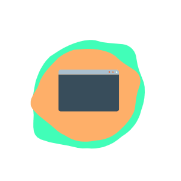

## Hi there, I'm Mertkaan Erdem (aka mekoer) :metal:

## I'm a Learner, Developer, Communicator

- I'm trying to learn everything about useful things / or useless _-sometimes-_
- I have a bachelor degree in Journalism (Istanbul University | 2017)
- I have an associate degree in Web Design and Coding (Anadolu University | 2020)
- I have some certificates on web and mobile development
- I'm a rapper from 90's that's like have a Rakim soul

#### Connect with me:

#### Languages and Tools:

 
 
